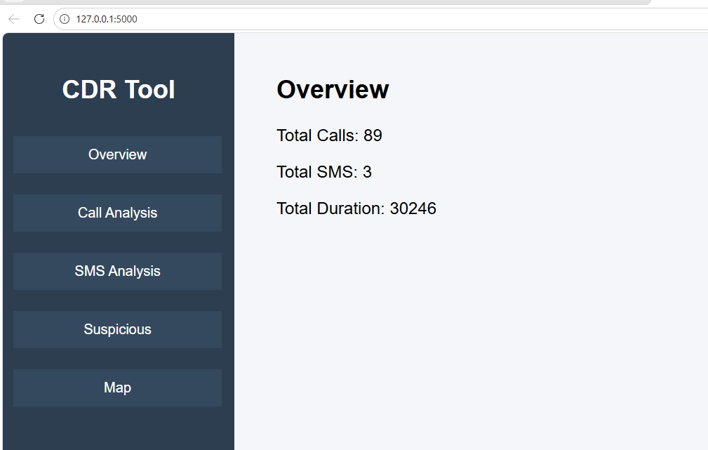
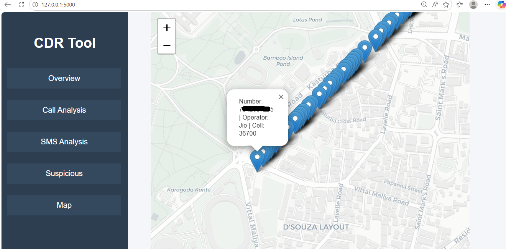
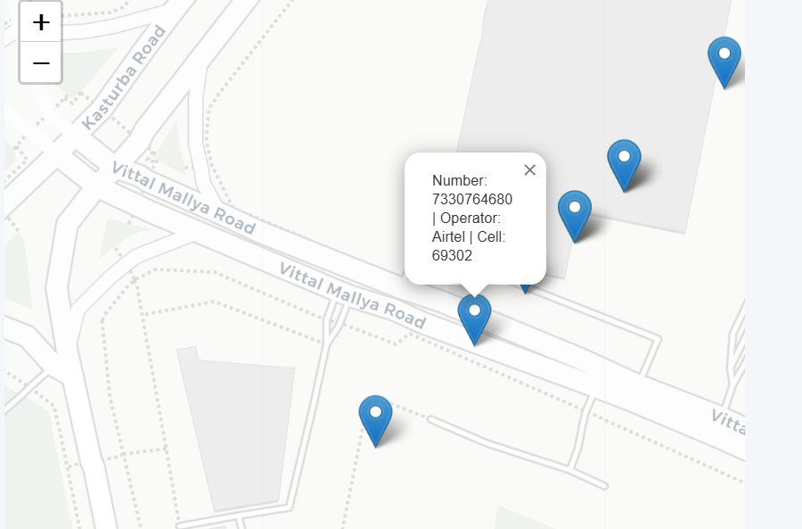
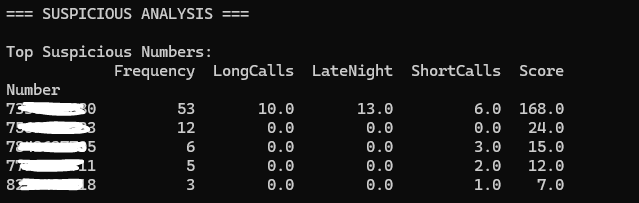

# CDR Forensic Analysis Dashboard

## Overview

The CDR Forensic Analysis Dashboard is a Python-based forensic analysis system developed for analyzing Call Detail Records (CDRs) obtained from telecom billing data.

The project processes call and SMS records to identify communication patterns, active hours, frequently contacted numbers, suspicious behavior, and approximate location activity using data visualization and an interactive web dashboard.

The system combines forensic data analysis, telecom simulation, visualization, and Flask-based dashboard integration to simplify investigation and communication trend analysis.

---

## Features

### Call Analysis
- Top contacted numbers
- Daily call activity trends
- Active communication hours

### SMS Analysis
- SMS activity patterns
- Top SMS contacts

### Suspicious Activity Detection
Detection based on:
- High call frequency
- Long-duration calls
- Late-night communication
- Repeated short-duration calls

### Telecom Data Simulation
- MCC
- MNC
- Operator identification
- Cell ID simulation
- LAC/TAC generation

### Interactive Dashboard
- Flask-based web interface
- Navigation sidebar
- Graph visualization
- Interactive map integration

### Map Visualization
Interactive telecom activity visualization using Folium maps.

---

## Technologies Used

| Technology | Purpose |
|---|---|
| Python | Backend logic and analysis |
| Pandas | Data processing |
| Matplotlib | Graph generation |
| Flask | Web dashboard |
| Folium | Map visualization |
| HTML/CSS | Frontend interface |

---

## Project Structure

```bash
CDR-Forensic-Analysis/
│
├── cdr_script.py
├── UI_script.py
├── web_page.html
├── map.html
├── CDR_Report.pdf
├── README.md
├── .gitignore
│
├── graphs/
│
└── screenshots/
```

---

## Workflow

1. Collect CDR data from telecom billing records
2. Convert extracted records into CSV format
3. Process datasets using Python and Pandas
4. Generate communication analysis graphs
5. Detect suspicious communication behavior
6. Generate telecom simulation details
7. Visualize results using Flask dashboard and Folium maps

---

## Installation

Install required libraries:

```bash
pip install pandas matplotlib flask folium
```

---

## Execution

Run the analysis script:

```bash
python cdr_script.py
```

Run the Flask dashboard:

```bash
python UI_script.py
```

Open browser:

```bash
http://127.0.0.1:5000
```

---

## Output

The system generates:
- Communication trend graphs
- SMS activity analysis
- Suspicious activity reports
- Telecom simulation details
- Interactive location mapping
- Flask-based forensic dashboard

---

## Privacy Note

Sensitive telecom data and phone numbers have been anonymized/masked for privacy purposes. Raw datasets are excluded from this repository.

---

## Academic Purpose

Developed as part of Digital Forensics and Information Security (DFIS) practical forensic analysis and visualization work.

## Dashboard Preview

### Main Dashboard



### Map Visualization



### Map Close-Up



### Suspicious Activity Analysis



## System Workflow

1. Collect telecom CDR data
2. Extract and structure records into CSV format
3. Process records using Python and Pandas
4. Generate communication analysis graphs
5. Detect suspicious communication behavior
6. Generate telecom simulation details
7. Display results using Flask dashboard and Folium maps

## Future Enhancements

- Real telecom API integration
- Advanced anomaly detection using machine learning
- Automated PDF extraction
- Real-time dashboard monitoring
- Database integration


